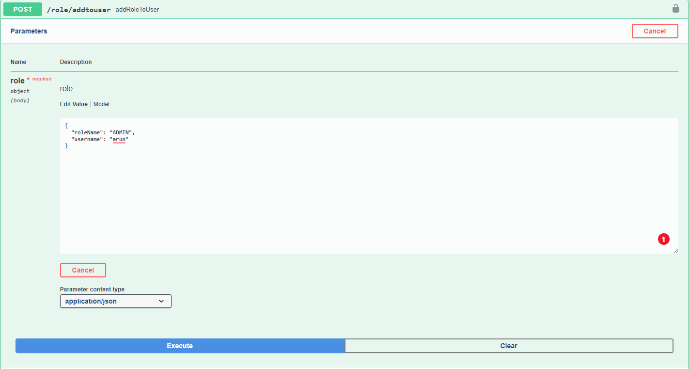
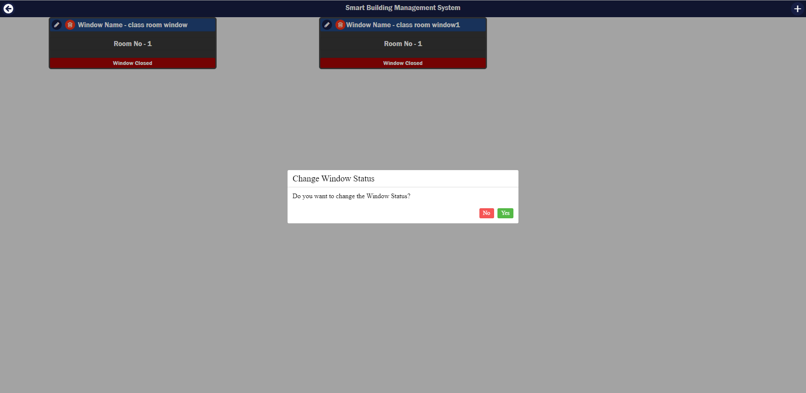

# Smart Building Management - Front-end
For testing the APIs go to this link
- http://arun.raveendrannairsheela.cleverapps.io/swagger-ui/index.html#/
- Name -  Arun Raveendran Nair Sheela

- Note -  I deployed three application in the clever cloud among those two are connected to same repository(for testing purpose)
#### Name of the deployed file

- [ ] faircorp-arun-raveendrannairsheela - link - http://arun.raveendrannairsheela.cleverapps.io/swagger-ui/index.html#/
- [ ] faircorp-arun-raveendransheela - link - http://arun.raveendrannairsheela1.cleverapps.io/swagger-ui/index.html#/
- both will work (security enabled)

#### Name of the deployed file without security - Used for the development of front-end application(Security disabled)

- [ ] arun-withoutsecuirty - https://app-0063e412-4308-46e7-894a-bbd5f26866c3.cleverapps.io/swagger-ui/index.html#/
#### In this backend project has five entities

- [ ] Building
- [ ] Room
- [ ] Heater
- [ ] Window 
- [ ] User -  User entity is used to create new user and assign roles to every created users

# Steps for running the application

- First we need to register using the api "/users/save" by enter the username, password and name.
at this time password is encoded and then store the data win the h2 db
  
- Before user registration,  I would suggest to create the roles via the API "/role/save". In this application I only planned for 2 roles 
ie ,  "USER" and "ADMIN".
- 
- After the above steps. now need add the roles to the registered users, 
by calling the username and roles to be assigned
- 
- 
- Now user can login using the api "/login".  
- After login, a access token ( jwt token) is send  as response. and user need to give this access code via swagger ui.
and the application will decide the right of user based on this access token
- After passing the access token, user work with the application.
- Format to pass access token  -  "Bearer "accesstoken""
- 
- As we said previously, we have two roles , "ADMIN" and "USER"
- "USER" is only allowed for "GET" method
- "ADMIN" is allowed for all the four http methods
- 
- - 

##  Security 

Here I added layer of security for authorization and authentication 

- For authentication  -  user can provide the username and password to get the access token 
- For authorization -  I used the JWT tokens for authorization. After login the user get the access tokens. This access token determine the access right of the signed in user. 
- For ADMIN - have all rights
- For USER -  only right to view the data
  

##  ADMIN credentials  - 
- [ ] username - "admin"
- [ ] password - "12345"

## USER credentials
- [ ] username - "user"
- [ ] password - "12345"

- [ ] I didn't add any restrictions for creating users and roles, login and also for added the roles to users. Anyone can create users and add roles.
- APIs can be accessed only after add roles each user 

## Controller

### Building Controller

### Room Controller

### Heater Controller 

### Window Controller

### User Controller

### Unit Test

- I added unit test of controller layer,  service layer and repository layer(For custom queries)
- Note -  I only added unit test for building controller and that is not working. I used jwt tokens to secure the api, I include this in the unit test but the test fails. I couldn't able to find the reason till now.
- Apart from this I added unit test for service layer and repository layer of all the entities(Except User) and it works fines

### Folder Structure

I used Controller, Service and repository layer for building the web APIs

# Smart Building Management System - Client

We have four entitie and created under the order Building, Rooms, Heater and Window respectively. 

- Also, I attached a vedio which explains the functionalities we implemented for your reference.Please check the "appdemovedio" folder for the vedios explanantion.

## Procedure to run the application 

We used online rest APIs for this application. and define the base url of the online api is provide in the variable.js file.

In case, if the online the version is not working, I attached the jar file of spring boot application in the folder named "backend" and also need to change the based url of the backend in the varible.js.

Note  -  Cors configuration is done at the backend side and We added the frontend end-point

### Run application 

- Step 1 -  Run "npm install"
- Step 2 -  Run "npm run serve"
- Step3  -  Go the url "http://localhost:8080/"

Already defined the port number in the vue.config.js file 

# Implemented features

- [ ] User can add new Building and display the added building information.
- [ ] User can navigate towards the added building and create room and also able to display the created rooms.
- [ ] User can able to navigate to heater and window from each room and also able create new heaters and windows.
- [ ] The created window and heater can edited and deleted.
- [ ] User can change the status of window and heater and display the changed status.
- [ ] Confirmation popup will display when delelting the heater or window and while changing the heater and window status.
- [ ] Corresponding notifications will come when creating new building and room 
- [ ] Notifcations will come when creating, editing, deleting and changing the status of windows and heater.
- [ ] Button is added in the top-left to navigate between the building and rooms and also from heater or window to rooms.

# Some images of the developed screen and functions

## Add new building 

## Display added buildings and notifaction to comfirm 

## Display four added buildings

## Navigate to rooms and add new rooms for a selected building 

## Add new room dialog box

## navigate to heater menu and add new heater and also show the notification when new heater is added 

## edit added heater 

## confirmation dialog box to delete the selected heater

## Confirmation dialog box to change heater status

## Dialog box to add new window

## Display the windows

## dialog box to edit windows

## confirmation dialog box to delete windows 

## confirmation dialog box to change window status

More more information about the feature , we requested to see the small vedio demo of the app.

